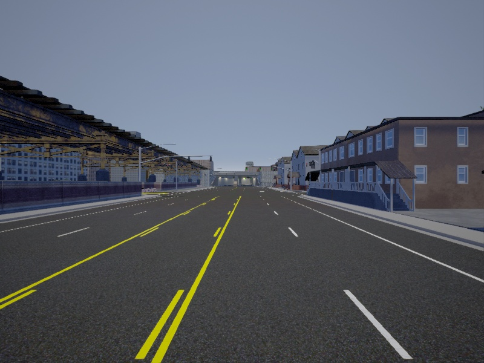
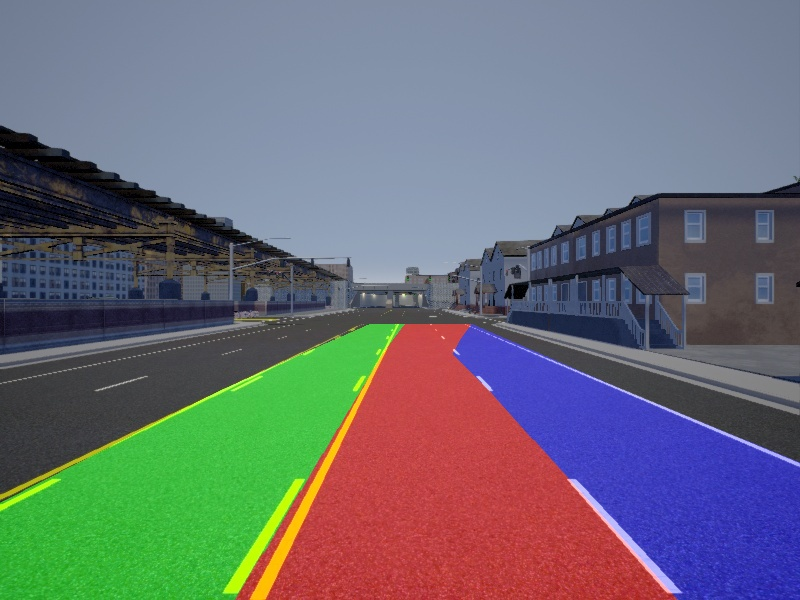

# LaneDetect

LaneDetect is a simple road lane detection algorithm using OpenCV, which I originally wrote in Python and then transferred to C++ to get familiar with the C++ API of OpenCV.

## Requirements

* Linux (I recommend Ubuntu 16.04 or 18.04)
* OpenCV Version >= 3.4 (sources [download](https://opencv.org/releases.html "OpenCV releases"), [installation instructions](https://docs.opencv.org/3.4.5/d7/d9f/tutorial_linux_install.html "OpenCV Installation tutorial")
* Spline header library from [here](https://github.com/ttk592/spline) (will be automatically downloaded if you run cmake)

## Build instructions

Clone this repository, e.g. git clone https://github.com/jhallier/LaneDetect

```shell
cd LaneDetect
mkdir build
cd build
cmake ..
make
```

## Usage
Run 

```
./LaneDetect [image filename]
```

or call the LaneDetect class functions from your own code.

## ToDo
1. Using different color spaces for improved lane detection
2. Smoothing over a few frames
3. Track lanes over time (assign IDs to lanes, distinguish own and other lanes)
4. Improve robustness at crossroads etc.

## Sample image

